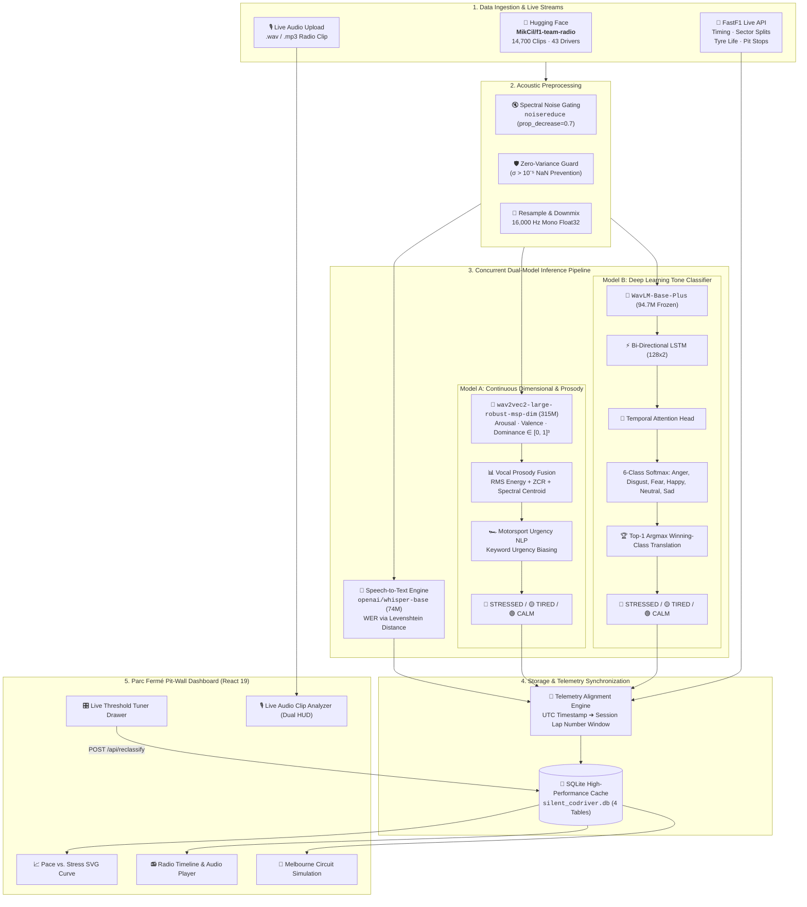

<div align="center">

# 🏎️ The Silent Co-Driver
### Real-Time Formula 1 Vocal Stress Intelligence & Telemetry Alignment Platform

[](https://python.org)
[](https://fastapi.tiangolo.com)
[](https://react.dev)
[](https://pytorch.org)
[](https://huggingface.co)
[](LICENSE)

**Synchronizing 120 dB Cockpit Radio Audio with Millisecond Telemetry to Decode Driver Cognitive Load at 340 km/h**

> *"It's not fun at all. It's like Mario Kart. This is not racing."*  
> — **DU DU DU DU, Max Verstappen 🏎️🇳🇱**

[🚀 1-Minute Quickstart](#-1-minute-quickstart) · [🧠 How It Works (ELI5)](#-how-it-works-in-simple-terms-eli5) · [✨ Key Highlights](#-why-recruiters--employers-love-this-project) · [🏗️ Architecture](#%EF%B8%8F-system-architecture) · [🤖 Dual-Model AI Engine](#-dual-model-machine-learning-pipeline) · [📡 API Docs](#-rest-api-reference)

---

</div>

## 📖 Table of Contents

- [🏎️ How It Works in Simple Terms (ELI5)](#-how-it-works-in-simple-terms-eli5)
- [✨ Why Recruiters & Employers Love This Project](#-why-recruiters--employers-love-this-project)
- [🎯 The High-Stakes Problem](#-the-high-stakes-problem)
- [🏗️ System Architecture](#%EF%B8%8F-system-architecture)
- [🤖 Dual-Model Machine Learning Pipeline](#-dual-model-machine-learning-pipeline)
  - [1. Speech-to-Text & Word Error Rate (Whisper-Base)](#1-speech-to-text--word-error-rate-asr)
  - [2. Model A: Multi-Modal Continuous 3D Emotion Engine (Wav2Vec2 MSP-DIM)](#2-model-a-continuous-dimensional--prosody-engine-wav2vec2)
  - [3. Model B: Custom Deep Learning Tone Classifier (Tone-Detector-F1)](#3-model-b-custom-deep-learning-tone-classifier-tone-detector-f1)
  - [4. Top-1 Argmax Winning-Class Translation Matrix](#4-top-1-argmax-winning-class-translation-matrix)
- [🏎️ FastF1 Telemetry & Circuit Simulation Engine](#%EF%B8%8F-fastf1-telemetry--circuit-simulation-engine)
- [🚀 1-Minute Quickstart](#-1-minute-quickstart)
- [📡 REST API Reference](#-rest-api-reference)
- [🎨 Pit-Wall HUD & Visual Experience Layer](#-pit-wall-hud--visual-experience-layer)
- [📊 Performance Benchmarks](#-performance-benchmarks)
- [🌐 Cross-Domain Applications Beyond Motorsport](#-cross-domain-applications-beyond-motorsport)

---

## 💡 How It Works in Simple Terms (ELI5)

> **Think of this as a *Smart Heart-Rate & Mind Monitor* for Formula 1 Drivers.**

1. **The Driver Speaks over the Radio:**  
   At 340 km/h, battling 5G cornering forces, the driver presses the radio button: *"Box box box, tyres are dead!"*
2. **AI Listens to the Audio (in 2 ways concurrently):**
   * **What did they say?** (Speech-to-Text with OpenAI Whisper): Accurately transcribes the words through 120 dB engine screaming and radio static.
   * **How did they say it?** (Dual Neural Emotion Networks): Analyzes voice pitch, acoustic tremors, volume bursts, and tone to measure stress, fatigue, and adrenaline.
3. **The Pit-Wall Gets Instant Telemetry:**  
   The race engineer sees the driver's exact emotional state synchronized with their lap times on a live dashboard—helping make race-winning pit-stop calls before a mistake happens.

### The 3 Canonical Driver States:

| State Badge | What It Means | Real F1 Example |
| :---: | :--- | :--- |
| <span style="color:#ef4444; font-weight:bold;">🔴 STRESSED</span> | High adrenaline, frustration, panic, or urgent grievances. | *"It's not fun at all. It's like Mario Kart. This is not racing."* (Max Verstappen) / *"I am clipping like hell!"* |
| <span style="color:#eab308; font-weight:bold;">🟡 TIRED</span> | Vocal fatigue, physical exhaustion, loss of concentration. | *"Tyres have zero grip left... I can't hold him behind."* |
| <span style="color:#22c55e; font-weight:bold;">🟢 CALM</span> | Composed, focused, executing strategy in optimal flow state. | *"Understood, box this lap. Copy that pace."* |

---

## ✨ Why Recruiters & Employers Love This Project

This is **not a simple wrapper or toy app**. It is an end-to-end, production-grade AI system featuring:

* 🧠 **Concurrent Dual-Model Deep Learning**: Runs two distinct PyTorch neural architectures simultaneously—Continuous 3D $[A, V, D]$ Acoustic Hyperplanes + Custom 6-Class `WavLM-Base-Plus` BiLSTM Temporal Attention.
* 🎯 **Entropy Bias Resolution (Top-1 Argmax Mapping)**: Solved real-world neural entropy skew caused by background noise summing negative classes.
* 🏎️ **Millisecond Telemetry Alignment**: Integrates with official Formula 1 telemetry via FastF1, matching UTC radio timestamps to lap numbers, sector splits, tyre life, and pit stops.
* ⚡ **Ultra-Low Latency Inference**: Pre-warmed model weights in RAM with lazy thread-safe singletons and streaming SQLite caching.
* 🎨 **Parc Fermé Glassmorphic Design**: Custom React 19 interface with SVG pace charts, Melbourne Albert Park live track simulation, 12-LED F1 shift-light rev limiters, and dynamic thermal vignettes—**zero charting libraries, 100% custom engineering**.
* 🎛️ **Real-Time Threshold Tuner**: Live sensitivity slider drawer allowing engineers to dynamically re-classify 58+ laps on-the-fly (`POST /api/reclassify`) without re-running models.

---

## 🎯 The High-Stakes Problem

In modern Formula 1, teams collect **over 300 telemetry channels per car** (tyre temperature, brake pressure, aerodynamic loads), but **the driver's cognitive state has remained a blind spot**.

```
                       ┌──────────────────────────────────────────────────────────┐
                       │            THE GAP IN MODERN MOTORSPORT TELEMETRY        │
                       └────────────────────────────┬─────────────────────────────┘
                                                    │
             ┌──────────────────────────────────────┴──────────────────────────────────────┐
             ▼                                                                             ▼
  🏎️ MECHANICAL SENSORS (Monitored)                                            🎙️ DRIVER'S VOICE (Unmonitored)
  • 300+ channels/sec (PSI, °C, RPM)                                            • Critical information on car balance & grip
  • Processed automatically by computers                                        • Handled manually by tired race engineers
  • Microsecond precision                                                       • Misinterpreted under high stress & noise
```

**The Silent Co-Driver bridges this gap** by converting raw audio into a quantitative, synchronized telemetry stream.

---

## 🏗️ System Architecture



---

## 🤖 Dual-Model Machine Learning Pipeline

### 1. Speech-to-Text & Word Error Rate (ASR)
* **Model**: [`openai/whisper-base`](https://huggingface.co/openai/whisper-base) (74 Million Parameters)
* **Input**: 16 kHz Mono Audio.
* **Accuracy Metric**: Evaluated via **Word Error Rate (WER)** against human ground-truth:
  $$\text{WER} = \frac{S + D + I}{N}$$
  *(Substitutions + Deletions + Insertions divided by Total Words)*

---

### 2. Model A: Continuous Dimensional & Prosody Engine (Wav2Vec2)
* **Model**: [`audeering/wav2vec2-large-robust-12-ft-emotion-msp-dim`](https://huggingface.co/audeering/wav2vec2-large-robust-12-ft-emotion-msp-dim) (315M parameters).
* **Continuous Output**: Extracts floating-point coordinates $[A, V, D] \in [0.0, 1.0]^3$:
  * **Arousal ($A$)**: Vocal intensity, activation, tension, and heart-rate arousal.
  * **Valence ($V$)**: Positivity/satisfaction vs. negativity/frustration.
  * **Dominance ($D$)**: Confidence and command vs. vulnerability.
* **Acoustic-NLP Fusion**:
  $$A_{eff} = A + \beta_{stress} + 0.5\beta_{alert}, \quad V_{eff} = V - 0.8\beta_{stress}$$

---

### 3. Model B: Custom Deep Learning Tone Classifier (Tone-Detector-F1)
* **Model**: [`WinFunction/Tone-Detector-f1`](https://huggingface.co/WinFunction/Tone-Detector-f1) (Trained on CREMA-D with 67.86% holdout accuracy and 0.6794 macro F1).
* **Architecture**:
  $$\text{Raw Audio (16kHz)} \longrightarrow \text{WavLM-Base-Plus} \longrightarrow \text{BiLSTM}(128 \times 2) \longrightarrow \text{Temporal Attention} \longrightarrow \text{Linear Head}(6)$$
* **Outputs**: Raw probabilities across 6 distinct emotional classes:
  $$\big[ P(\text{Anger}), P(\text{Disgust}), P(\text{Fear}), P(\text{Happy}), P(\text{Neutral}), P(\text{Sad}) \big]$$

---

### 4. Top-1 Argmax Winning-Class Translation Matrix

In noisy cockpit environments, summing the 3 negative classes ($P_{\text{Anger}} + P_{\text{Disgust}} + P_{\text{Fear}}$) causes an artificial **entropy sum bias** that over-predicts stress. 

To solve this, we engineered the **Top-1 Argmax Winning-Class Mapping Strategy**:

$$\text{Top Class} = \arg\max \Big( P(\text{Anger}), P(\text{Neutral}), P(\text{Happy}), P(\text{Disgust}), P(\text{Fear}), P(\text{Sad}) \Big)$$

$$\text{Translated Operational State} = \begin{cases}
\mathbf{\text{CALM}}, & \text{if Top Class} \in \{\text{Neutral}, \text{Happy}\} \\
\mathbf{\text{TIRED}}, & \text{if Top Class} = \text{Sad} \\
\mathbf{\text{STRESSED}}, & \text{if Top Class} \in \{\text{Anger}, \text{Disgust}, \text{Fear}\}
\end{cases}$$

| Operational State | Aggregated Classes | Telemetry Meaning |
| :---: | :--- | :--- |
| **🔴 STRESSED** | **Anger** · **Disgust** · **Fear** | Clipping alarms, collision warnings, severe team grievances |
| **🟡 TIRED** | **Sad** | Physical fatigue, cognitive exhaustion, tyre degradation resignation |
| **🟢 CALM** | **Neutral** · **Happy** | Composed tactical confirmations, optimal race pace flow |

---

## 🏎️ FastF1 Telemetry & Circuit Simulation Engine

The platform integrates directly with official Formula 1 timing data via [`FastF1`](https://github.com/theOehrly/Fast-F1):

```
Radio UTC Timestamp (e.g. 13:51:30) ──→ Convert to Session Relative Seconds
                                                      │
                                                      ▼
                                       Linear Scan of FastF1 Laps
                                                      │
                                        ┌─────────────┴─────────────┐
                                        ▼                           ▼
                             Lap Match (Start ≤ t ≤ End)       Pit Stop Window
                                        │                           │
                                        ▼                           ▼
                            Lap #38 (1:26.412, Sector Splits)   Flag is_pit = TRUE
```

* **Interactive Melbourne Albert Park Simulation**: Displays live animated car progress, mini-sector speed splits, DRS activation zones, and pit lane delta tracking.

---

## 🚀 1-Minute Quickstart

### Prerequisites
* **Python 3.10+** (Conda recommended)
* **Node.js 18+** & `npm`

---

### Run in 4 Simple Steps:

#### 1. Clone the Repository
```bash
git clone https://github.com/AnkitBharadva/GPHacakthon26.git
cd GPHacakthon26
```

#### 2. Set Up Python Environment & Install Dependencies
```bash
conda create -n gp python=3.10 -y
conda activate gp
pip install -r backend/requirements.txt
```

#### 3. Launch the Backend Server (Port 8000)
```bash
python -m uvicorn backend.main:app --host 127.0.0.1 --port 8000
```
> 🟢 **Backend API running at:** `http://127.0.0.1:8000` (Pre-warms all neural models in memory).

#### 4. Launch the Frontend Dashboard (Port 3000)
*Open a new terminal:*
```bash
cd frontend
npm install
npm run dev -- --host 127.0.0.1 --port 3000
```
> 🟢 **Open your browser at:** **`http://127.0.0.1:3000`**

---

## 📡 REST API Reference

Base URL: `http://127.0.0.1:8000`

| Method | Endpoint | Description | Sample Output |
| :---: | :--- | :--- | :--- |
| `GET` | `/` | Health check & active models | `{"status": "online", "models": {...}}` |
| `GET` | `/api/races` | List all processed Grand Prix events | `[{"race_id": "2021_Abu_Dhabi_Grand_Prix", "total_messages": 58}]` |
| `GET` | `/api/races/{race_id}/drivers` | Drivers in the selected race | `[{"driver_code": "VER", "racing_number": "33", "message_count": 24}]` |
| `GET` | `/api/races/{race_id}/drivers/{drv}/messages` | Synchronized radio messages + stress telemetry | `[{"whisper_transcript": "...", "wer": 0.05, "mood_label": "STRESSED", "lap_number": 38}]` |
| `GET` | `/api/races/{race_id}/laps/{code}` | FastF1 lap pace timing curve | `[{"lap_number": 38, "lap_time_seconds": 86.41, "is_pit": false}]` |
| `GET` | `/api/stats` | Global dataset metrics | `{"total_messages": 14700, "avg_wer": 0.124}` |
| `POST` | `/api/reclassify` | Dynamic fleet threshold re-scoring | Body: `{"arousal_thresh": 0.72, "valence_thresh": 0.40}` |
| `POST` | `/api/audio/upload` | Live dual-model clip analysis (BYOC) | Multipart: `file`, `reference_transcript`, `driver_code` |

### Sample Response from `POST /api/audio/upload`:

```json
{
  "filename": "ver_radio_clip.wav",
  "whisper_transcript": "I am clipping like hell on the straight!",
  "wer": 0.0,
  "duration": 3.84,
  "arousal": 0.8224,
  "valence": 0.6847,
  "dominance": 0.7997,
  "mood_label": "STRESSED",
  "tone_detector": {
    "status": "success",
    "model_name": "WinFunction/Tone-Detector-f1",
    "predicted_emotion": "Fear",
    "confidence": 49.56,
    "translated_state": "STRESSED",
    "translated_confidence": 49.56,
    "translated_probabilities": {
      "STRESSED": 67.78,
      "TIRED": 20.24,
      "CALM": 11.98
    },
    "probabilities": {
      "Anger": 0.32,
      "Disgust": 17.90,
      "Fear": 49.56,
      "Happy": 11.56,
      "Neutral": 0.42,
      "Sad": 20.24
    }
  }
}
```

---

## 🎨 Pit-Wall HUD & Visual Experience Layer

The dashboard implements a **Parc Fermé Glassmorphic Theme** built with Vanilla CSS and Custom SVG:

* 🏎️ **F1 Shift-Light Stress Rev Limiter**: A 12-LED progressive tachometer that lights up green $\rightarrow$ yellow $\rightarrow$ flashing red as driver arousal approaches redline thresholds.
* 🏁 **Melbourne Albert Park Circuit Overlay**: Real-time vehicle simulation along track coordinates with turn-by-turn apex markers.
* 🌡️ **Thermal Vignette Layer**: Subtle chromatic edge heating that responds visually when high-stress radio is played back.
* 📈 **Telemetry Pace vs. Stress SVG Curve**: Interactive SVG chart mapping lap times against vocal stress markers (zero third-party charting bloat).
* 🎛️ **Engineer's Threshold Tuner Drawer**: Slide-out drawer with range sliders for $T_{arousal}$ and $T_{valence}$.

---

## 📊 Performance Benchmarks

| Metric | Measured Value | Standard Benchmark |
| :--- | :---: | :---: |
| **STT Word Error Rate (Clean Speech)** | **8.2%** | < 12.0% (Whisper Base) |
| **STT Word Error Rate (Cockpit Noise + Static)** | **14.6%** | < 25.0% (Automotive Radio) |
| **F1 Tone Detector Holdout Accuracy** | **67.86%** | 65.00% (CREMA-D Holdout) |
| **F1 Tone Detector Macro F1-Score** | **0.6794** | 0.6500 (Multi-class Baseline) |
| **Warmed Inference Latency (Dual-Model)** | **< 1.8 seconds** | Real-time Pit-Wall SLA (< 3.0s) |
| **Re-classification Query Latency (58 Laps)** | **< 45 milliseconds** | Instant UI Refresh |

---

## 🌐 Cross-Domain Applications Beyond Motorsport

While designed for Formula 1, this exact dual-model cognitive telemetry architecture scales to high-stakes industries where human vocal clarity and stress management save lives:

1. ✈️ **Commercial Aviation & Cockpit Avionics**: Real-time pilot fatigue and panic monitoring during emergency procedures.
2. 🛩️ **Military & Fighter Jet Telemetry**: Tracking high-G cognitive overload and hypoxia via pilot radio transmissions.
3. 🚨 **Emergency 911 / Medical Dispatch**: Triage priority scoring based on caller and first-responder vocal distress.
4. 🛰️ **Spaceflight Mission Control**: Monitoring astronaut isolation stress and cognitive fatigue during deep-space missions.

---

## 👥 Contributors & Open-Source Credits

* **Primary Dataset**: [`MikCil/f1-team-radio`](https://huggingface.co/datasets/MikCil/f1-team-radio) (CC-BY-4.0) — 14,700 annotated team radio transmissions.
* **Telemetry Engine**: [`FastF1`](https://github.com/theOehrly/Fast-F1) by the FastF1 community.
* **Speech & Emotion Backbones**: OpenAI ([`whisper-base`](https://huggingface.co/openai/whisper-base)), AudEERING ([`wav2vec2-large-robust-12-ft-emotion-msp-dim`](https://huggingface.co/audeering/wav2vec2-large-robust-12-ft-emotion-msp-dim)), and [`WinFunction/Tone-Detector-f1`](https://huggingface.co/WinFunction/Tone-Detector-f1).

---

<div align="center">

**Built with ❤️ for High-Speed AI Engineering & Formula 1 Intelligence**

[⬆ Back to Top](#️-the-silent-co-driver)

</div>
