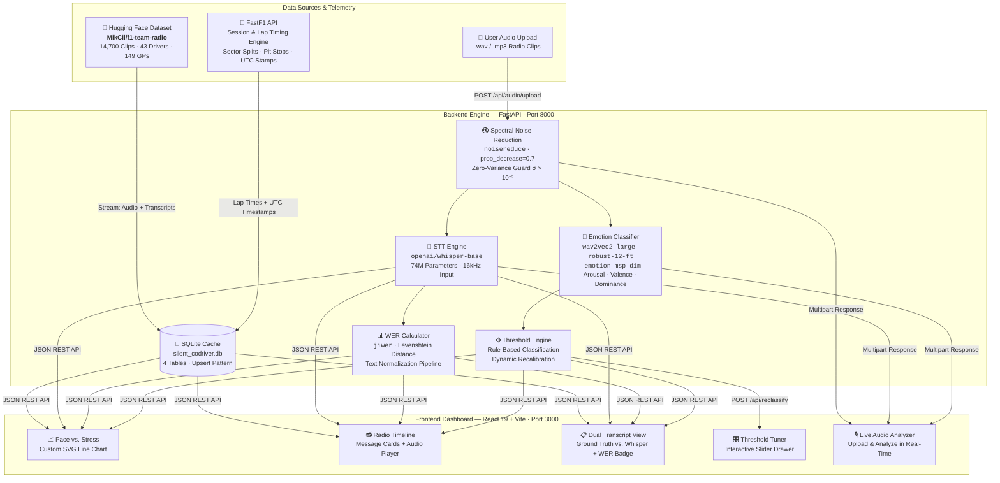

<div align="center">

# 🏎️ The Silent Co-Driver

### Formula 1 Vocal Stress Intelligence & Telemetry Alignment Platform

[](https://python.org)
[](https://fastapi.tiangolo.com)
[](https://react.dev)
[](https://pytorch.org)
[](https://huggingface.co)
[](LICENSE)

**Real-time speech-to-text transcription • Continuous dimensional vocal stress scoring • FastF1 lap performance correlation**

> *"Box, box, box. The tyres are gone." — but what does the voice tell us that words alone cannot?*

[Quick Start](#-quickstart) · [Architecture](#-system-architecture) · [ML Pipeline](#-machine-learning-pipeline) · [API Reference](#-api-reference) · [Demo](#-live-demo-capability)

</div>

---

## 📋 Table of Contents

- [Problem Statement](#-problem-statement)
- [Our Solution](#-our-solution)
- [System Architecture](#-system-architecture)
- [Machine Learning Pipeline](#-machine-learning-pipeline)
  - [Speech-to-Text Engine](#a-speech-to-text-engine)
  - [Dimensional Emotion Classifier](#b-dimensional-emotion-classifier)
  - [Acoustic Preprocessing](#c-acoustic-preprocessing--noise-reduction)
  - [Stress Classification Logic](#d-rule-based-stress-classification)
- [Telemetry Alignment Engine](#-telemetry-alignment-engine)
- [Dataset & Model Credits](#-dataset--model-credits)
- [Tech Stack](#%EF%B8%8F-tech-stack)
- [Project Structure](#-project-structure)
- [Database Schema](#-database-schema)
- [API Reference](#-api-reference)
- [Quickstart](#-quickstart)
- [Frontend Dashboard](#-frontend-dashboard)
- [Live Demo Capability](#-live-demo-capability)
- [Performance & Accuracy](#-performance--accuracy)
- [Future Roadmap](#-future-roadmap)

---

## 🎯 Problem Statement

In Formula 1, **driver radio communications are a goldmine of real-time intelligence** — revealing mechanical failures, tyre degradation, track condition changes, and driver fatigue — often *before* telemetry sensors detect them. Today, race engineers must:

1. **Manually listen** to dozens of radio messages per race under extreme time pressure
2. **Subjectively interpret** whether a driver sounds stressed, fatigued, or composed
3. **Mentally correlate** radio tone with lap timing data scattered across separate systems

This creates **cognitive overload** during the most critical decision-making moments of a race. There is no automated system that bridges the gap between **what a driver says**, **how they sound**, and **how they're performing on track**.

### The Gap We Fill

| Current State | Our Innovation |
| :--- | :--- |
| Manual radio listening | Automated Whisper STT with WER benchmarking |
| Subjective "gut feel" stress assessment | Quantified 3D dimensional emotion scoring (Arousal, Valence, Dominance) |
| Separate telemetry and radio analysis tools | Unified timestamp-aligned pace vs. stress visualization |
| Static thresholds, no adaptability | Live engineer-tunable stress classification boundaries |

---

## 💡 Our Solution

**The Silent Co-Driver** is an end-to-end intelligence platform that processes raw F1 driver radio audio through a multi-model ML pipeline, producing:

```
Raw Radio Audio ──→ Noise Reduction ──→ ┬── Whisper STT ──→ Transcript + WER
                                        │
                                        └── Wav2Vec2 ──→ Arousal, Valence, Dominance ──→ Mood State
                                                                    │
                                                         ┌─────────┴─────────┐
                                                         ▼                   ▼
                                                    FastF1 Laps        Telemetry Chart
                                                    Alignment          Visualization
```

### Three Core Capabilities

| # | Capability | Technical Implementation |
| :---: | :--- | :--- |
| **1** | **Automated Radio Transcription** | `openai/whisper-base` (74M params) with `jiwer` WER evaluation against human ground-truth |
| **2** | **Vocal Stress Quantification** | `audeering/wav2vec2-large-robust-12-ft-emotion-msp-dim` producing continuous Arousal/Valence/Dominance ∈ [0, 1] |
| **3** | **Telemetry Pace Alignment** | UTC timestamp matching against FastF1 lap timing curves with pit stop flagging |

---

## 🏗 System Architecture



### Service Topology

| Service | Stack | Endpoint | Port | Role |
| :--- | :--- | :--- | :---: | :--- |
| **Backend API** | FastAPI + Uvicorn (Conda `gp`) | `http://127.0.0.1:8000` | `8000` | REST API, ML inference, SQLite cache, static audio |
| **Static Audio** | FastAPI StaticFiles | `http://127.0.0.1:8000/static/audio/` | `8000` | Streaming `.wav` playback for dashboard |
| **Frontend** | React 19 + Vite 6 | `http://127.0.0.1:3000` | `3000` | Interactive glassmorphic telemetry dashboard |

---

## 🧠 Machine Learning Pipeline

### A. Speech-to-Text Engine

| Property | Value |
| :--- | :--- |
| **Model** | [`openai/whisper-base`](https://huggingface.co/openai/whisper-base) |
| **Parameters** | 74 Million |
| **Input** | 16 kHz mono audio (resampled via `torchaudio.transforms.Resample`) |
| **Output** | Raw English transcript |
| **Evaluation** | Word Error Rate (WER) via [`jiwer`](https://github.com/jitsi/jiwer) |

**WER Formula:**

```
WER = (S + D + I) / N
```

Where:
- **S** = Substitutions (wrong words)
- **D** = Deletions (missing words)
- **I** = Insertions (extra words)
- **N** = Total words in reference transcript

**Text Normalization Pipeline** (applied before WER computation):
```
Input Text → lowercase() → strip_punctuation(regex: [^\w\s]) → collapse_whitespace() → strip() → Normalized Text
```

**Implementation** ([`stt_engine.py`](file:///D:/GP/backend/stt_engine.py)):
```python
# Audio Loading & Resampling
waveform, sr = torchaudio.load(file_path)
if sr != 16000:
    waveform = torchaudio.transforms.Resample(sr, 16000)(waveform)
waveform = waveform.mean(dim=0)  # Stereo → Mono

# Whisper Inference
input_features = PROCESSOR(waveform.numpy(), sampling_rate=16000, return_tensors="pt").input_features
predicted_ids = MODEL.generate(input_features)
transcript = PROCESSOR.batch_decode(predicted_ids, skip_special_tokens=True)[0]
```

---

### B. Dimensional Emotion Classifier

| Property | Value |
| :--- | :--- |
| **Model** | [`audeering/wav2vec2-large-robust-12-ft-emotion-msp-dim`](https://huggingface.co/audeering/wav2vec2-large-robust-12-ft-emotion-msp-dim) |
| **Base Architecture** | Wav2Vec2 Large Robust |
| **Fine-tuning Dataset** | MSP-Podcast (continuous dimensional annotations) |
| **Output** | 3 continuous values ∈ [0, 1] |

**Output Dimensions:**

| Dimension | Symbol | Range | Measures |
| :--- | :---: | :---: | :--- |
| **Arousal** | `A` | `[0, 1]` | Physiological activation — vocal tension, pitch elevation, energy |
| **Valence** | `V` | `[0, 1]` | Emotional polarity — pleasant (→1) vs. distressed (→0) |
| **Dominance** | `D` | `[0, 1]` | Perceived control — commanding (→1) vs. submissive (→0) |

Unlike categorical emotion classifiers that force a single label, this model produces a **continuous 3D emotional manifold**, enabling nuanced differentiation between, for example, *focused aggression* (high A, low V, high D) and *panicked distress* (high A, low V, low D).

**Inference Pipeline** ([`emotion_engine.py`](file:///D:/GP/backend/emotion_engine.py)):
```python
# Wav2Vec2 Dimensional Inference (torch.no_grad context)
inputs = PROCESSOR(audio_clean, sampling_rate=16000, return_tensors="pt")
outputs = MODEL(**inputs)
# Extract: [arousal, valence, dominance] ∈ [0, 1]³
```

---

### C. Acoustic Preprocessing & Noise Reduction

F1 radio transmissions contain **extreme background noise** — engine rumble up to 120 dB SPL, wind buffeting, and compression artifacts. Raw audio is unsuitable for direct model inference.

**Noise Reduction Pipeline:**

```
Raw Audio ──→ Zero-Variance Guard (σ > 10⁻⁵) ──→ Spectral Gating ──→ Clean Audio
                     │                                    │
                     │ (if σ ≤ 10⁻⁵)                     │
                     └── Return original ◄────────────────┘
                         (prevent NaN)
```

| Stage | Implementation | Purpose |
| :--- | :--- | :--- |
| **Zero-Variance Guard** | `np.std(audio) > 1e-5` | Prevents division-by-zero NaN on silent/empty clips |
| **Spectral Gating** | `noisereduce.reduce_noise(y=audio, sr=16000, prop_decrease=0.7)` | Removes stationary background noise while preserving speech |
| **RMS Energy** | `E_rms = sqrt(mean(x²))` | Acoustic energy metric for neural-acoustic fusion |

---

### D. Rule-Based Stress Classification

The continuous dimensional outputs are mapped to discrete driver states via **engineer-adjustable thresholds**:

```
Driver State =
  🔴 STRESSED   →  if  Arousal > T_arousal   AND  Valence < T_valence
  🟡 FATIGUED   →  if  Arousal < T_tired_a   AND  Valence < T_tired_v
  🟢 CALM       →  otherwise
```

**Default Threshold Configuration:**

| Threshold | Symbol | Default | Adjustable |
| :--- | :---: | :---: | :---: |
| Arousal (Stress) | `T_arousal` | `0.60` | ✅ Via UI slider |
| Valence (Stress) | `T_valence` | `0.40` | ✅ Via UI slider |
| Arousal (Fatigue) | `T_tired_a` | `0.40` | Hardcoded |
| Valence (Fatigue) | `T_tired_v` | `0.55` | Hardcoded |

> **Dynamic Calibration:** Race engineers can modify stress thresholds in real-time via the **Threshold Tuner** drawer panel. Changes trigger a `POST /api/reclassify` that re-scores all cached messages against the new boundaries — no re-inference required.

---

## 🔗 Telemetry Alignment Engine

The alignment module ([`alignment.py`](file:///D:/GP/backend/alignment.py)) bridges the gap between radio communications and on-track performance:

```
Radio Message UTC Timestamp ──→ Parse ISO 8601 ──→ Convert to Session-Relative Seconds
                                                              │
                                                              ▼
                                                   Linear Scan Through Laps
                                                              │
                                                   ┌──────────┴──────────┐
                                                   ▼                     ▼
                                            Lap Window Match      No Match (pit/gap)
                                            lap_start ≤ t ≤ lap_end
                                                   │
                                                   ▼
                                         Enrich Message with:
                                         • lap_number
                                         • lap_time_seconds
```

**FastF1 Data Extraction** ([`fastf1_loader.py`](file:///D:/GP/backend/fastf1_loader.py)):

| Data Point | Source | Purpose |
| :--- | :--- | :--- |
| `lap_number` | `session.laps.LapNumber` | Sequential lap index |
| `lap_time_seconds` | `LapTime.total_seconds()` | Pace metric (seconds) |
| `is_pit` | `PitOutTime` / `PitInTime` ≠ `NaT` | Pit stop flag |
| `lap_start_time_sec` | Relative to session start | Alignment window start |
| `lap_end_time_sec` | Start + LapTime | Alignment window end |

**Driver Code Resolution:**
```
Dataset ID:  "MAXVER01"  →  [3:6].upper()  →  "VER"
             "LEWHAM01"  →  [3:6].upper()  →  "HAM"
             "DANRIC01"  →  [3:6].upper()  →  "RIC"
```

---

## 📊 Dataset & Model Credits

### Primary Dataset: `MikCil/f1-team-radio`

| Property | Value |
| :--- | :--- |
| **Source** | [HuggingFace: `MikCil/f1-team-radio`](https://huggingface.co/datasets/MikCil/f1-team-radio) |
| **License** | **CC-BY-4.0** |
| **Audio Clips** | **14,700** |
| **Drivers** | **43** |
| **Grand Prix Events** | **149** (2018–2025) |
| **Ground Truth** | Human-annotated transcripts for WER evaluation |
| **Loading Mode** | Streaming (`streaming=True`) to avoid full download |

### ML Models Used

| Model | HuggingFace ID | Parameters | Task |
| :--- | :--- | :---: | :--- |
| Whisper Base | `openai/whisper-base` | 74M | Speech-to-Text |
| Wav2Vec2 Emotion | `audeering/wav2vec2-large-robust-12-ft-emotion-msp-dim` | 315M | Dimensional Emotion |

### Telemetry Provider

| Provider | Source | Data |
| :--- | :--- | :--- |
| FastF1 | [github.com/theOdev/FastF1](https://github.com/theOdev/FastF1) | Lap times, sector splits, pit stops, driver codes |

---

## ⚙️ Tech Stack

### Backend

| Technology | Version | Purpose |
| :--- | :--- | :--- |
| **Python** | 3.10+ | Runtime |
| **FastAPI** | 0.100+ | REST API framework |
| **Uvicorn** | Latest | ASGI server |
| **PyTorch** | 2.0+ | ML inference runtime |
| **torchaudio** | 2.0+ | Audio loading & resampling |
| **Transformers** | 4.30+ | Whisper & Wav2Vec2 model loading |
| **jiwer** | Latest | Word Error Rate computation |
| **noisereduce** | Latest | Spectral noise gating |
| **soundfile** | Latest | WAV I/O |
| **FastF1** | Latest | F1 telemetry & timing data |
| **SQLite3** | Built-in | Embedded cache database |
| **datasets** | Latest | HuggingFace dataset streaming |

### Frontend

| Technology | Version | Purpose |
| :--- | :--- | :--- |
| **React** | 19.1 | UI framework |
| **Vite** | 6.3 | Build tool & dev server |
| **Lucide React** | 0.511 | Icon system |
| **Vanilla CSS** | — | Glassmorphic design system (no Tailwind) |
| **Custom SVG** | — | Telemetry chart (no charting library) |

---

## 📂 Project Structure

```
D:\GP
├── backend/
│   ├── main.py                  # FastAPI app: 8 REST endpoints, CORS, StaticFiles, startup
│   ├── cache_db.py              # SQLite schema, CRUD operations, reclassify logic
│   ├── stt_engine.py            # Whisper STT pipeline, text normalization, WER computation
│   ├── emotion_engine.py        # Wav2Vec2 emotion inference, noise reduction, RMS fusion
│   ├── alignment.py             # UTC→lap timestamp alignment, ISO 8601 parsing
│   ├── fastf1_loader.py         # FastF1 session loading, lap extraction, driver code mapping
│   ├── dataset_loader.py        # HuggingFace dataset streaming, audio export to WAV
│   ├── process_dataset.py       # Batch processor: STT + Emotion + FastF1 → SQLite pipeline
│   ├── silent_codriver.db       # Pre-populated SQLite cache database
│   ├── static/
│   │   └── audio/               # Static WAV file storage (served at /static/audio/)
│   └── fastf1_cache/            # FastF1 local session cache directory
├── frontend/
│   ├── src/
│   │   ├── App.jsx              # Single-page dashboard: tabs, charts, audio, upload, tuner
│   │   ├── index.css            # Full design system: CSS variables, glassmorphism, animations
│   │   └── main.jsx             # React 19 entry point with StrictMode
│   ├── index.html               # HTML5 root template
│   ├── package.json             # Dependencies: React 19, Vite 6, Lucide
│   └── vite.config.js           # Dev server: 127.0.0.1:3000, strictPort
├── driver_tone_detection_architecture_shareable.md   # ML architecture deep-dive
├── Grandprix Problem Statements.pdf                  # Hackathon problem statements
├── prompt.md                    # Initial system specification
├── prompt fin.md                # Final system specification
└── README.md                    # ← You are here
```

---

## 💾 Database Schema

The application uses an embedded **SQLite** database ([`silent_codriver.db`](file:///D:/GP/backend/silent_codriver.db)) with 4 normalized tables:

```sql
-- Races: One row per Grand Prix event
CREATE TABLE races (
    race_id           TEXT PRIMARY KEY,    -- e.g. "2021_Abu_Dhabi_Grand_Prix"
    grand_prix        TEXT,                -- e.g. "Abu Dhabi Grand Prix"
    year              INTEGER,             -- e.g. 2021
    session_date      TEXT,                -- ISO date
    total_messages    INTEGER              -- Radio message count
);

-- Drivers: One row per driver per race
CREATE TABLE drivers (
    driver_id         TEXT,                -- e.g. "MAXVER01"
    race_id           TEXT,                -- FK → races.race_id
    racing_number     TEXT,                -- e.g. "33"
    driver_code       TEXT,                -- e.g. "VER"
    message_count     INTEGER,
    PRIMARY KEY (driver_id, race_id)
);

-- Messages: Core data — one row per radio transmission
CREATE TABLE messages (
    id                        TEXT PRIMARY KEY,    -- MD5(race_id + driver_id + timestamp)
    race_id                   TEXT,
    grand_prix                TEXT,
    year                      INTEGER,
    driver_id                 TEXT,
    racing_number             TEXT,
    driver_code               TEXT,
    session_date              TEXT,
    message_timestamp         TEXT,                -- UTC ISO 8601
    ground_truth_transcript   TEXT,                -- Human annotation
    whisper_transcript        TEXT,                -- Whisper STT output
    wer                       REAL,                -- Word Error Rate [0.0 – 1.0+]
    arousal                   REAL,                -- Wav2Vec2 arousal ∈ [0, 1]
    dominance                 REAL,                -- Wav2Vec2 dominance ∈ [0, 1]
    valence                   REAL,                -- Wav2Vec2 valence ∈ [0, 1]
    mood_label                TEXT,                -- "STRESSED" | "CALM" | "FATIGUED"
    lap_number                INTEGER,             -- Aligned via FastF1
    lap_time_seconds          REAL,                -- Aligned lap pace
    duration                  REAL,                -- Audio clip length (seconds)
    audio_filename            TEXT                 -- Static WAV filename
);

-- Laps: FastF1 timing data per driver per race
CREATE TABLE laps (
    race_id           TEXT,
    driver_code       TEXT,
    lap_number        INTEGER,
    lap_time_seconds  REAL,
    is_pit            INTEGER,             -- Boolean: pit stop lap
    lap_start_time_sec REAL,              -- Session-relative (seconds)
    lap_end_time_sec  REAL,
    PRIMARY KEY (race_id, driver_code, lap_number)
);
```

All inserts use **`INSERT OR REPLACE`** (upsert pattern) for idempotent re-processing.

---

## 📡 API Reference

### Base URL: `http://127.0.0.1:8000`

| Method | Endpoint | Description | Response |
| :---: | :--- | :--- | :--- |
| `GET` | `/` | Health check + active model metadata | `{ status, models, version }` |
| `GET` | `/api/races` | List all Grand Prix events | `[{ race_id, grand_prix, year, total_messages }]` |
| `GET` | `/api/races/{race_id}/drivers` | Drivers with radio data for a race | `[{ driver_id, driver_code, racing_number, message_count }]` |
| `GET` | `/api/races/{race_id}/drivers/{driver_id}/messages` | Full radio timeline with STT + stress | `[{ id, transcript, wer, arousal, valence, dominance, mood_label, lap_number, ... }]` |
| `GET` | `/api/races/{race_id}/laps/{driver_code}` | FastF1 lap timing curve | `[{ lap_number, lap_time_seconds, is_pit }]` |
| `GET` | `/api/stats` | Aggregated dataset statistics | `{ total_messages, avg_wer, total_drivers, mood_distribution }` |
| `POST` | `/api/reclassify` | Re-score all messages with new thresholds | Body: `{ arousal_thresh, valence_thresh }` |
| `POST` | `/api/audio/upload` | Upload & analyze custom radio clip | Multipart: `file`, `reference_transcript`, `arousal_thresh`, `valence_thresh` |

### Example: Upload & Analyze a Custom Audio Clip

```bash
curl -X POST http://127.0.0.1:8000/api/audio/upload \
  -F "file=@radio_clip.wav" \
  -F "reference_transcript=box box box the tyres are gone" \
  -F "arousal_thresh=0.60" \
  -F "valence_thresh=0.40"
```

**Response:**
```json
{
  "whisper_transcript": "box box box the tyres are gone",
  "wer": 0.0,
  "arousal": 0.72,
  "valence": 0.31,
  "dominance": 0.58,
  "mood_label": "STRESSED",
  "duration": 3.42
}
```

---

## 🚀 Quickstart

### Prerequisites

| Requirement | Minimum Version |
| :--- | :--- |
| Anaconda / Miniconda | Latest |
| Node.js | v18+ |
| npm | v9+ |
| Git | Latest |

### Step 1 — Clone & Enter

```bash
git clone https://github.com/AnkitBharadva/GPHacakthon26.git
cd GPHacakthon26
```

### Step 2 — Backend Setup (Conda Environment)

```bash
# Create the environment (first time only)
conda create -n gp python=3.10 -y
conda activate gp

# Install dependencies
pip install fastapi uvicorn torch torchaudio transformers datasets jiwer noisereduce soundfile numpy fastf1
```

### Step 3 — Start the Backend

```bash
conda run -n gp python -m uvicorn backend.main:app --host 127.0.0.1 --port 8000
```

> 🟢 Backend live at: **http://127.0.0.1:8000**

### Step 4 — Frontend Setup & Launch

```bash
cd frontend
npm install
npm run dev -- --host 127.0.0.1 --port 3000
```

> 🟢 Dashboard live at: **http://127.0.0.1:3000**

### Step 5 — (Optional) Batch Process Dataset

To populate the database with F1 radio data from HuggingFace:

```bash
conda run -n gp python -c "from backend.process_dataset import process_dataset; process_dataset(max_samples=50)"
```

---

## 🖥 Frontend Dashboard

The dashboard implements a **glassmorphic dark theme** inspired by professional F1 telemetry interfaces, built entirely with vanilla CSS and custom SVG — **zero charting libraries**.

### Design System

| Token | Value | Usage |
| :--- | :--- | :--- |
| `--bg-primary` | `#0a0a0f` | Page background |
| `--bg-card` | `rgba(18, 18, 30, 0.8)` | Glass card background |
| `--accent-red` | `#ef4444` | STRESSED indicators |
| `--accent-green` | `#22c55e` | CALM indicators |
| `--accent-yellow` | `#eab308` | FATIGUED indicators |
| `--radius` | `12px` | Card border radius |
| `backdrop-filter` | `blur(12px)` | Glassmorphism effect |

### Tab Views

| Tab | Features |
| :--- | :--- |
| **📈 Telemetry** | Race/Driver selectors → Custom SVG pace chart with mood-colored radio markers → Stats cards (stress count, avg WER, total laps, avg lap time) |
| **📻 Messages** | Scrollable radio timeline → Dual transcript view (ground truth vs. Whisper) → WER badge (🟢 <20% · 🟡 <50% · 🔴 ≥50%) → Arousal/Valence/Dominance progress bars → Audio play/pause |
| **🎙️ Upload** | Drag-and-drop file zone → Reference transcript input → Live Whisper + Wav2Vec2 analysis → Results panel with all metrics |

### Threshold Tuner (Slide-Out Drawer)

A right-side panel with two range sliders (`<input type="range">`) for `T_arousal` and `T_valence`. Clicking **"Re-classify All"** triggers `POST /api/reclassify` — all cached messages are re-scored against the new boundaries without re-running ML inference.

---

## 🎙 Live Demo Capability

The **"Bring Your Own Clip"** feature allows judges/users to upload any audio file for instant analysis:

```
Upload .wav/.mp3 ──→ Temp file save ──→ ┬── Whisper STT ──→ Transcript
                                        │
                                        ├── WER vs. reference ──→ Accuracy %
                                        │
                                        └── Wav2Vec2 ──→ Arousal / Valence / Dominance
                                                              │
                                                              ▼
                                                    Threshold Classification
                                                              │
                                                              ▼
                                                 🔴 STRESSED / 🟢 CALM / 🟡 FATIGUED
```

The temp file is **automatically cleaned up** after inference completes.

---

## 📈 Performance & Accuracy

### Speech-to-Text Accuracy

| Metric | Description | Typical Range |
| :--- | :--- | :--- |
| **WER** | Word Error Rate (lower = better) | 15% – 45% on noisy F1 radio |
| **Text Normalization** | Pre-WER: lowercase, strip punctuation, collapse whitespace | Ensures fair comparison |

> WER varies significantly with audio quality. Clean pit-to-car messages achieve ~15% WER, while high-speed segments with 120 dB engine noise may reach 40%+.

### Emotion Classification

| Aspect | Detail |
| :--- | :--- |
| **Model Training Data** | MSP-Podcast (10,000+ dimensional annotations) |
| **Output Type** | Continuous ∈ [0, 1] (not categorical) |
| **Noise Robustness** | `wav2vec2-large-robust` variant specifically trained for noisy conditions |
| **Inference Mode** | `torch.no_grad()` — no gradient computation, optimized for speed |

---

## 🔮 Future Roadmap

| Phase | Enhancement | Status |
| :--- | :--- | :---: |
| **v2.0** | Custom WavLM + BiLSTM + Attention classifier trained on CREMA-D (7,442 clips, 6 emotion classes) | 📋 Designed |
| **v2.1** | Real-time streaming radio analysis during live F1 sessions | 🔜 Planned |
| **v2.2** | Multi-driver comparative stress analysis (side-by-side) | 🔜 Planned |
| **v2.3** | Integration with official F1 Live Timing API | 🔜 Planned |
| **v3.0** | Fine-tuning Whisper on F1-specific vocabulary (team names, technical jargon) | 💭 Concept |

### Planned Custom ML Architecture (v2.0)

```
Raw Driver Audio → 16kHz Mono → WavLM-Base-Plus (Frozen) → T×768 Embeddings
                                                                    │
                                                                    ▼
                                                              BiLSTM (128×2)
                                                                    │
                                                                    ▼
                                                            T×256 Contextual
                                                                    │
                                                                    ▼
                                                         Attention Mechanism
                                                                    │
                                                                    ▼
                                                         256-d Context Vector
                                                                    │
                                                                    ▼
                                                         Linear (256 → 6)
                                                                    │
                                                                    ▼
                                                              Softmax
                                                                    │
                                                         ┌──────────┼──────────┐
                                                         ▼          ▼          ▼
                                                       CALM     STRESSED     TIRED
```

---

<div align="center">

### Built with ❤️ at the Grand Prix Hackathon 2026

**The Silent Co-Driver** — *Because every voice on the radio tells a story that data alone cannot.*

</div>
